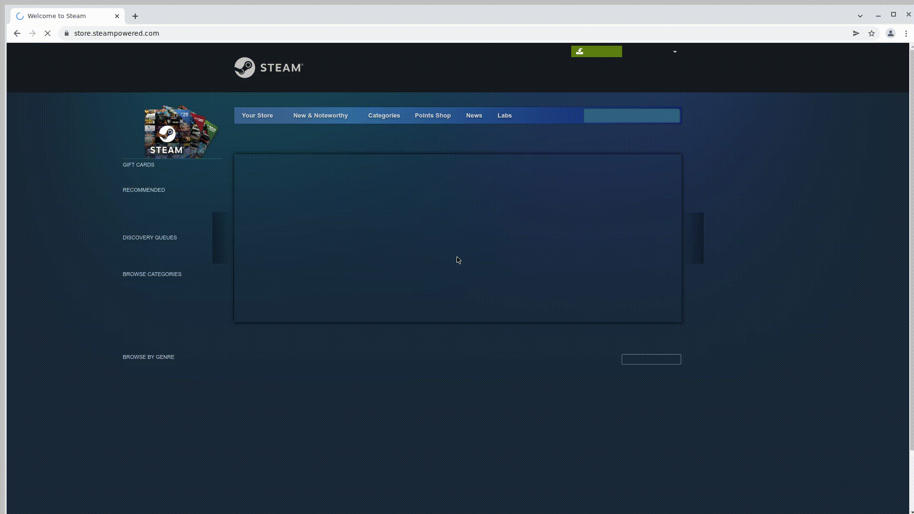
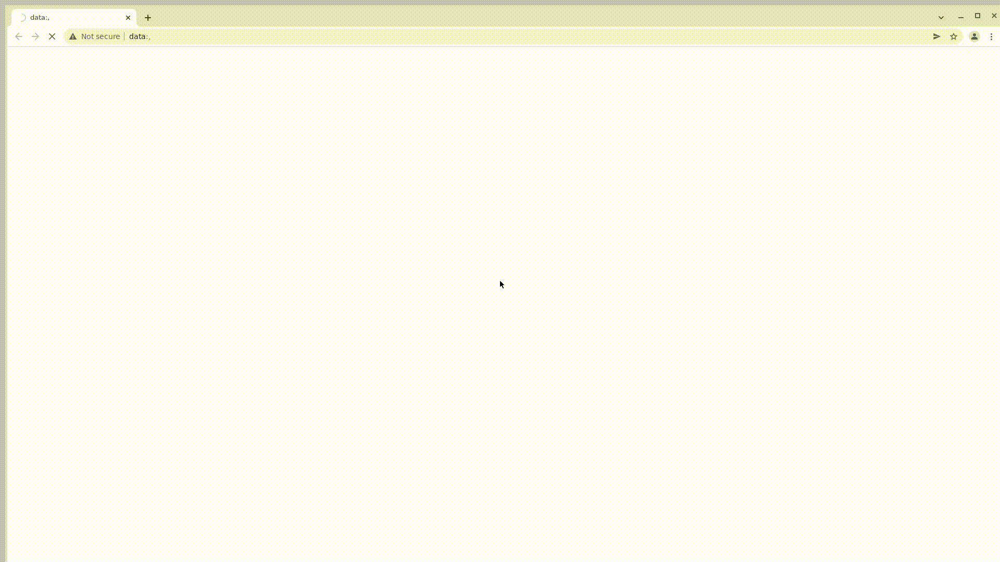
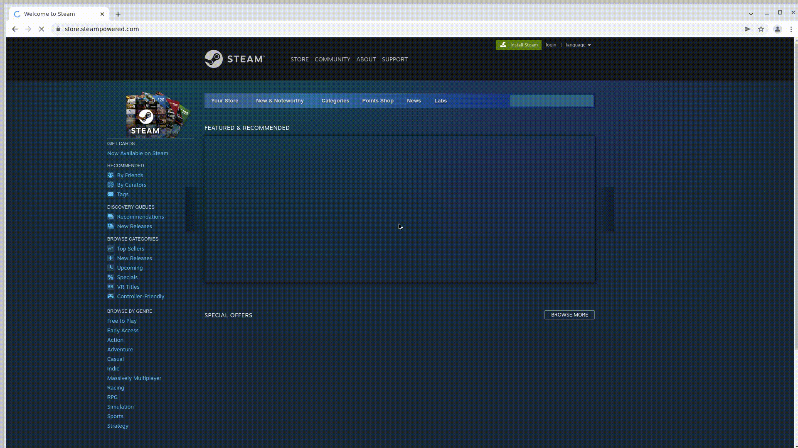
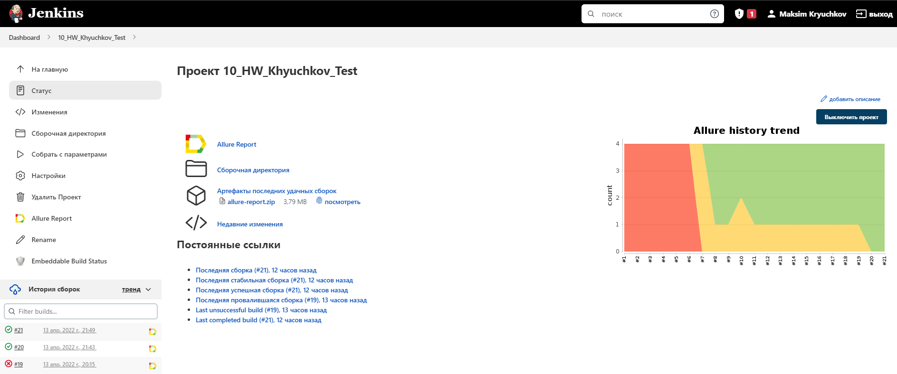
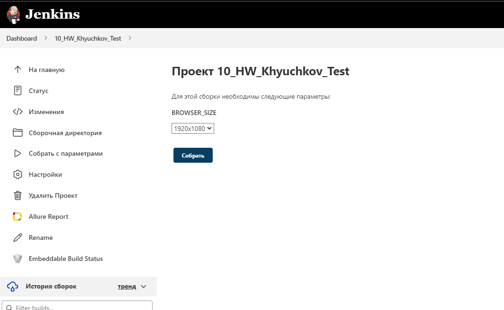
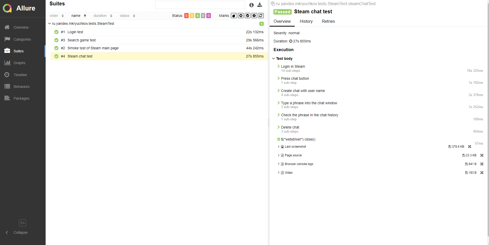
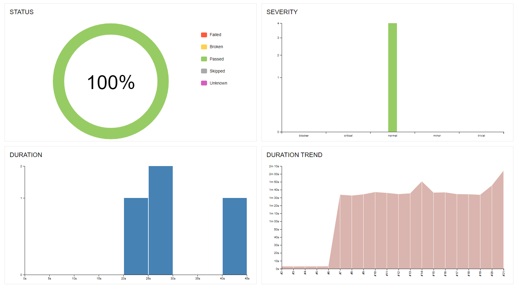
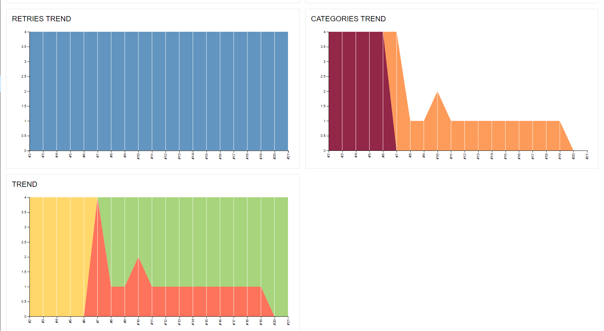
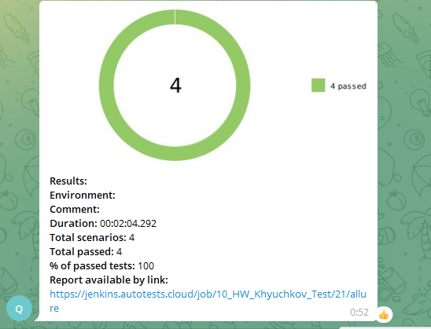

# Автотесты для сайта <a target="_blank" href="https://store.steampowered.com/">Steam</a>! 


## ✔️ Реализованы четыре теста для сайта :

#### - 1️⃣ **steamMainPageTest()** 

Smoke тест заглавной страницы магазина. Цель этого кейса убедиться, что основные элементы на главной странице магазина присутсвуют и выполняют бизнесс логику. Выполнен тест с помощью Page Object. ~~Все ведь любят PO?~~

✓ По href проверяются ссылки в верхней и нижней частях сайта. Они должны вести на нужные части сайта

✓ Проверяется окно поиска

✓ На баннерах с предложениями должны работать стрелки переключения. При этом нужно убедиться, что игры в баннерах действительно меняются при нажатии на стрелку

✓ В цикле проверяются четыре вкладки с предложениями. При наведении на них мыши всплывает окно с соответствующей игрой 

#### Пример прохождения теста : 


#### - 2️⃣ **searchGameTest()**

Проверка окна поиска игры. На примере Dota 2 убеждаемся, что строка поика игр работает. Дотка на месте? За Стим можно не беспокоиться!

✓ Поиск по названию выдает желаемые результаты

✓ Href ведет именно на Dota 2

#### Пример прохождения теста : 



#### - 3️⃣ **loginTest()**

Еще один критичный сценарий - пользователь сайта должен иметь возможность залогиниться, иначе зачем все это?

✓ Страница логина открывается при переходе с главной страницы магазины

✓ Вводим логин и пароль 

✓ Убеждаемся, что при переходе на главную страницу мы залогинены


#### Пример прохождения теста : 



#### - 4️⃣ **steamChatTest()**

Проверяем функционал чата внутри Стима. Можно передать любую фразу в переменную *chatPhrase* и убедиться, что именно она появится в отправленных сообщениях. Если у тебя совсем нет друзей, то так можно коротать вечера. Поверь мне 😢

✓ Логинимся на сайте магазина

✓ Переходим в раздел "чаты"

✓ Создаем чат с нашим логином

✓ Отправляем туда заданную фразу и проверяем, что она отображается в истории сообщений

✓ Удаляем чат

#### Пример прохождения теста : 



##  ⚒️  Используемые технологии и инструменты :


## </a> Jenkins <a target="_blank" href="https://jenkins.autotests.cloud/job/10_HW_Khyuchkov_Test/"> job </a>






## Для локального запуска :
```bash
gradle clean test
```

## Для удаленного запуска с параметрами :
```bash
clean
test
-Dsize=${BROWSER_SIZE}
```
___
## </a> Отчет в <a target="_blank" href="https://jenkins.autotests.cloud/job/10_HW_Khyuchkov_Test/20/allure/">Allure report</a>

### Overview :


### Suites : 



### Graphs :
                                                   




## </a> Отчет в телеграмм о результатах тестов :




## Остались вопросы? 
<a href="https://t.me/raboznik">
</a> 

<a href="mailto:raboznik@gmail.com">
</a>  


